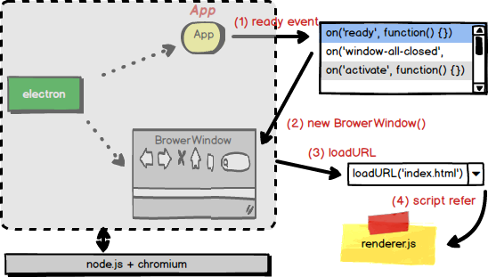
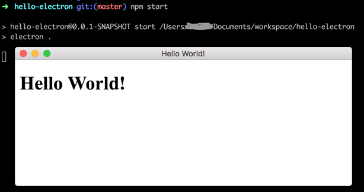
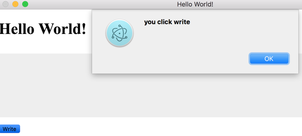

# hello-electron

## index.html

刚开始，只有一个 ``index.html``页面，显示``Hello World``：

``` html
<!DOCTYPE html>
<html>
<head>
  <meta charset="UTF-8">
  <title>Hello World!</title>
</head>
<body>
  <h1>Hello World!</h1>
</body>

</html>
```

这个页面可在本地直接用浏览器打开，提交``c1-index.html``。

## server.js

除了本地直接用浏览器打开``index.html``，我们还可以用``node.js``写一个web server，以便在浏览器中输入：http://127.0.0.1:8080/index.html

``` javascript

var http = require('http');
var fs = require('fs');

http.createServer( function (request, response) {

  console.log('request comming: ' + request.url);

  fs.readFile('index.html', function (err, data) {
    response.writeHead(200, {'Content-Type': 'text/html'});
    response.write(data.toString());
    response.end();
  });

}).listen(8080);

console.log('server running at http://127.0.0.1:8080/');
```

这段代码逻辑比较简单，加载了两个模块：``http``和``fs``，前者是Web服务器，后者是文件系统。用``http``在8080端口启动一个Web服务，对任何请求，都读取``index.html``并写入客户端做HTTP响应（文件读取是异步的）。


运行 ``server.js``：

``` bash
$ node server.js
server running at http://127.0.0.1:8080/
request comming: /index.html
```

上述代码提交日志是：``c2-server.js``。

## main.js

基于node的B/S结构，并不是我们的目标。我们期望用``electron``来加载``index.html``，而无需网络通信，我们要构建桌面程序。

``` javascript
var electron = require('electron');

electron.app.on('ready', function createWindow () {

  new electron.BrowserWindow(
      {width: 800, height: 600}
    ).loadURL('file://' + __dirname + "/index.html")

} );
```

上述``main.js``代码，不再需要用户在浏览器上输入URL，而是主动加载URL：

>``.loadURL('file://' + __dirname + "/index.html")``

这个``loadURL``的能力，是``electron``模块的，因此开头``var electron = require('electron');``。

``electron``有两个重要对象：
- ``app``: 管理应用程序的声明周期。代码``app.on('ready', function () {})``表示当应用初始化完毕后，创建一个窗口。
- ``BrowserWindow``: 浏览器窗口对象。可以用 ``new electron.BrowserWindow()`` 的方式创建一个窗口，并``loadURL``一个html页面。

组成结构和加载过程如下图所示：



直接运行``node main.js``会报错，找不到``electron``模块，原因是它不是node的内置模块，我们借助``npm``包管理器来运行。

``` bash
$ node main.js

Error: Cannot find module 'electron'
    at Function.Module._resolveFilename (module.js:325:15)
    at Function.Module._load (module.js:276:25)
```

>``npm``之于``node.js``，犹如``maven``之于``java``。``maven``用``pom.xml``描述依赖关系；而``npm``用``package.json``描述依赖关系。

``package.json``内容：

``` json
{
  "name": "hello-electron",
  "version": "0.0.1-SNAPSHOT",
  "description": "HelloWorld electron",
  "main": "main.js",
  "scripts": {
    "start": "electron ."
  },
  "devDependencies": {
    "electron": "~1.6.2"
  }
}
```

上面主要描述了3个信息：

- **meta**: 关于项目本身的描述，比如``name``，``version``等。
- **入口**：程序的入口是``main.js``，需要用``electron .``来启动。这里的``electron``是``npm``的全局模块，可提前安装``npm install -g electron`` （一定要以``-g``选项安装）。
- **依赖**：描述项目依赖``electron-1.6.2``版本。

完后，在项目根目录下直接运行：

``` bash
$ npm start
```

或者 ``electron .`` 也可以。



代码提交日志：``c3-main.js``


## 网页交互

接着丰富下``index.html``，在页面上弄个输入框和按钮。用``CSS``样式渲染下输入框；并用``javascript``响应按钮点击事件。

- 按钮响应动作

``` html
<body>
  <h1>Hello World!</h1>
  <textarea rows="10"></textarea>
  <button onclick="alert('you click write');">Write</button>
</body>
```

- 输入框渲染

``` html
<head>
  <style type="text/css">
  body {
    margin: 0;
  }

  textarea {
    width: 100%;
    border: none;
    background: #eee;
    margin: 10px 0;
    padding: 0;
    outline: none;
  }
  </style>
</head>
```

- 运行效果



git提交日志：``c4-interaction``


## 调用node

刚才演示的跟传统网页没任何区别，依然是纯前端技术（指基于浏览器的）。但是``electron``是桌面程序，它的特别之处在于：在``.html``网页中，可以直接引用``node.js``，相当于直接从前端跨入了后端，而且无需网络通信。

- renderer.js

``` javascript

var fs = require('fs');

var myTextarea = document.getElementsByTagName('textarea')[0];
var myButton = document.getElementsByTagName('button')[0];

// get input from textarea and write it into message.txt

function writeFile() {
  var text = myTextarea.value;
  fs.writeFileSync('message.txt',
  text, 'utf8');
}

myButton.onclick = writeFile;

```

这段javascript是node，但是它却可以访问网页的DOM对象，这就是``electron``的神奇之处。

- 引用js

在``index.html``中，引用JS：

``` html
<body>
  <h1>Hello World!</h1>
  <textarea rows="10"></textarea>
  <button>Write</button>
</body>

<script>
   require('./renderer.js')
</script>
```

git提交日志：``c5-callnode``


---

# 参考资料

- [用node写简易的静态Web服务器](http://www.runoob.com/nodejs/nodejs-web-module.html)

- [用electron写的扬声器应用](http://get.ftqq.com/7870.get)
